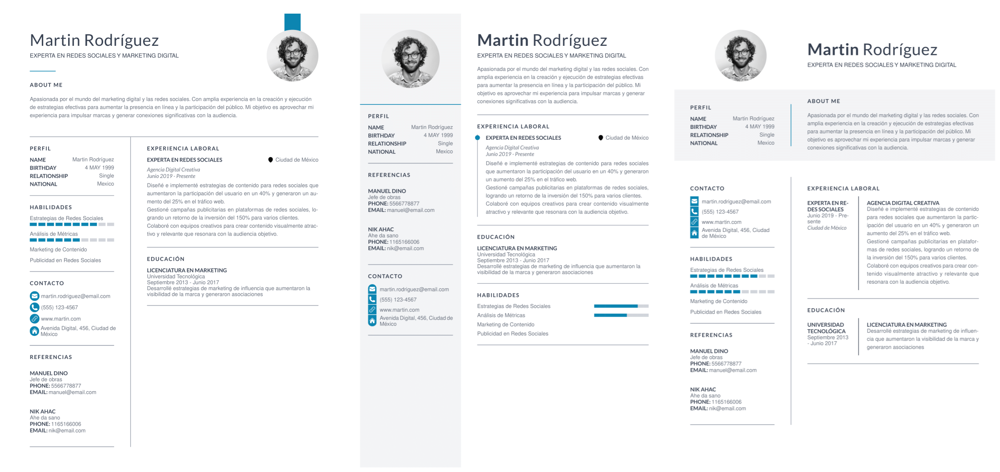

# 7 different CV designs made with react-pdf and tailwind

<a href="./public" align="center">
  
</a>

See [results](https://github.com/Spacey4K/react-pdf-cv/tree/main/public/results).
## Getting Started

First, install dependencies and run the development server:

```bash
npm i
npm run dev
```

Open [http://localhost:3000](http://localhost:3000) with your browser to see the result.


## Lost?
Both packages are confusingly called `react-pdf`.
- For displaying PDFs in React: [react-pdf](https://github.com/wojtekmaj/react-pdf)
- For creating PDFs with React: [@react-pdf/renderer](https://github.com/diegomura/react-pdf)
